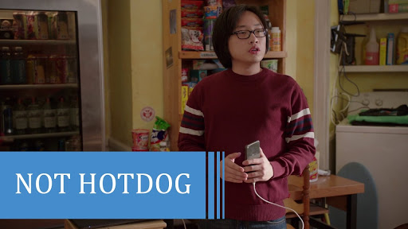

# not-hotdog 🌭

Detect if Hotdog or not hotdog!

<p align="center">
  
</p>

# Installation

```sh
yarn add not-hotdog
```

# Usage

```js
const { isHotdog, notHotdog } = require('not-hotdog');

console.log(isHotdog('hotdog')); // true
console.log(notHotdog('hotdog')); // false

console.log(isHotdog('pizza')); // false
console.log(notHotdog('pizza')); // true

console.log(isHotdog('🌭')); // true
console.log(isHotdog('🍕')); // false

```